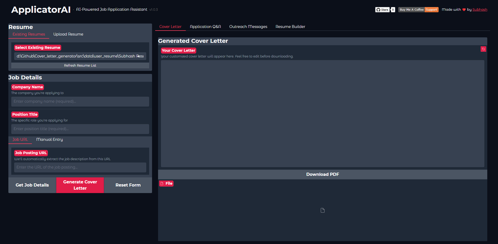
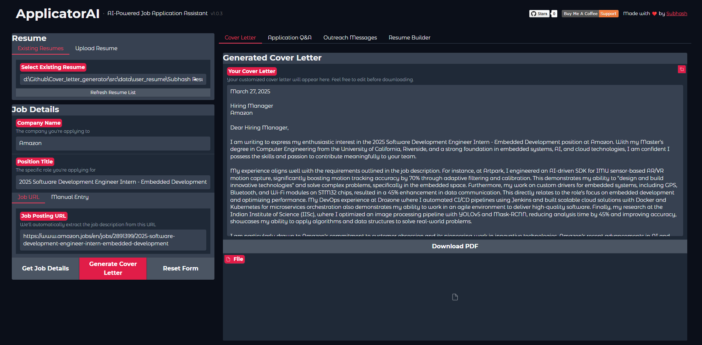
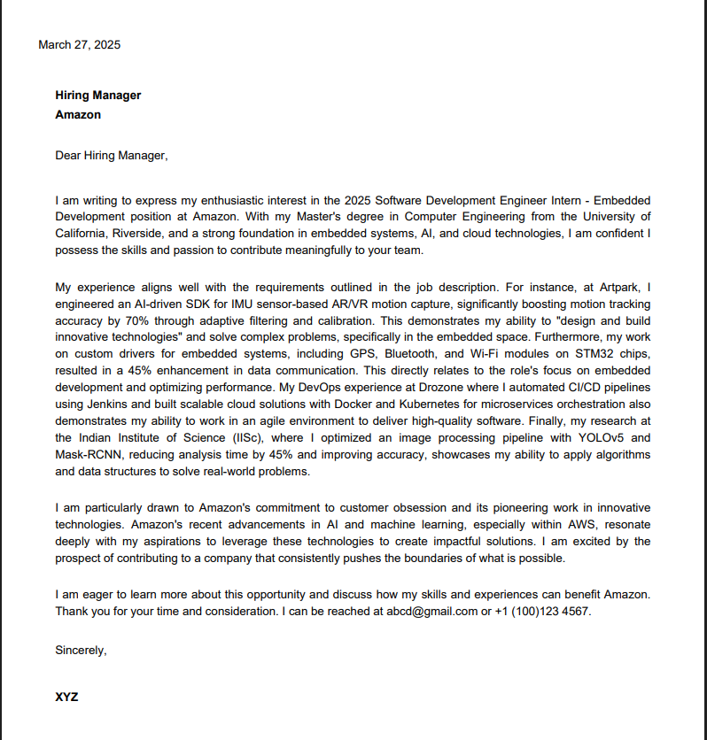
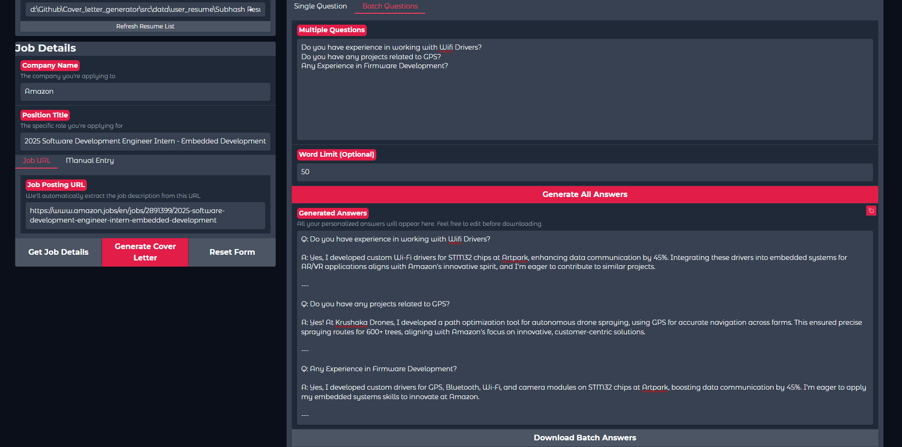
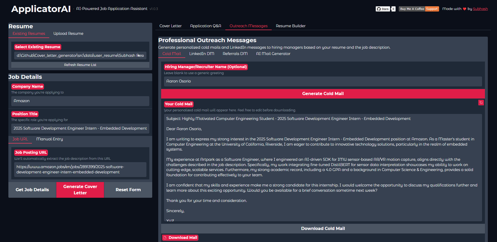
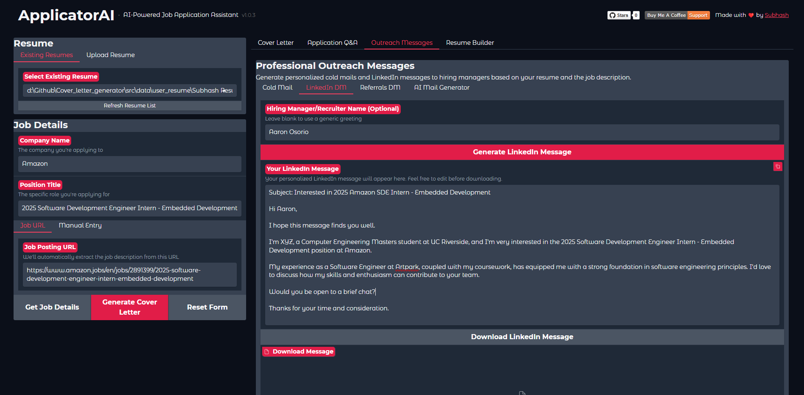
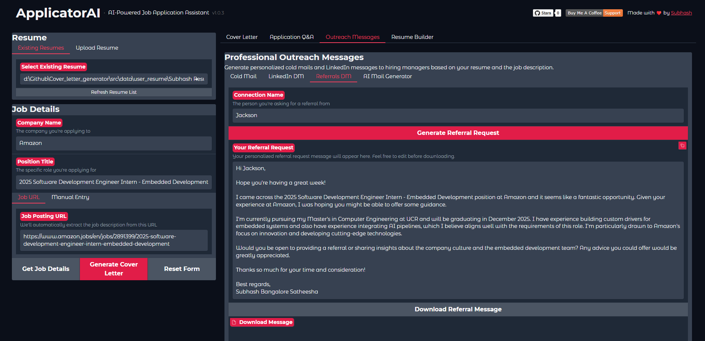
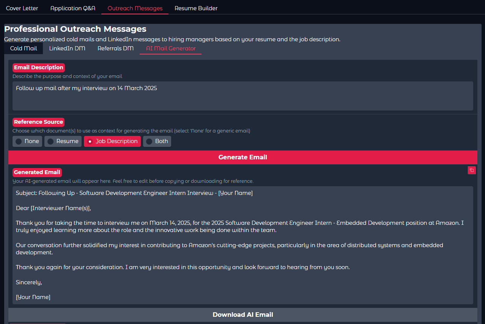

# Applicator AI🚀

## AI-Powered Job Application Assistant

 [](https://github.com/subhashbs36/ApplicatorAI/issues) [](https://github.com/subhashbs36/ApplicatorAI/stargazers) [](https://github.com/subhashbs36/ApplicatorAI/blob/main/LICENSE)  [](https://github.com/subhashbs36/ApplicatorAI/blob/main/Dockerfile)

---

## 🌟 Overview

Applicator is an AI-powered job application assistant that simplifies and enhances the application process. Whether you're crafting a cover letter, optimizing your resume, or answering application questions, Applicator ensures that your application materials stand out.

### 💡 Why Use Applicator?
- **User-Friendly**: No prior experience needed.
- **AI-Generated Content**: Personalized cover letters and application responses.
- **Resume Optimization**: Tailor your resume to specific job descriptions.
- **Professional Communication**: Assistance with crafting outreach emails and messages.
- **Flexible Deployment**: Works in both local and Docker environments.
- **Open Source**: Fully accessible and customizable to help you land your dream job.

---

## ✨ Key Features

### ✅ **Cover Letter Generation**
- **Personalized Content**: Automatically generate cover letters tailored to your resume and specific job descriptions.
- **Highlight Relevant Skills**: Emphasize your most pertinent experiences and skills.
- **Downloadable Output**: Export your cover letters as PDFs for easy submission.

### ✅ **Application Q&A Assistant**
- **Precise Answers**: Generate accurate responses to job application questions.
- **Customizable Length**: Control response length with word limit settings.
- **Batch Processing**: Support for both single and multiple question processing.

### ✅ **Professional Outreach Tools**
- **Cold Emails**: Craft compelling introductory emails to potential employers.
- **LinkedIn Messages**: Generate connection requests and messages.
- **Referral Requests**: Create professional communications for referrals.

### ✅ **Resume Builder and Optimizer**
- **AI-Powered Optimization**: Enhance your resume sections using AI insights.
- **LaTeX Templates**: Utilize ATS-friendly LaTeX resume templates for a polished look.
- **Custom Templates**: Upload and work with your own resume templates.
- **Error Detection**: Automatically detect and fix errors in your resume.
- **Easy Export**: Export your resume as a PDF effortlessly.

### ✅ **Job Description Analysis**
- **Key Information Extraction**: Analyze job postings to extract essential details.
- **Skill Matching**: Automatically match your skills with job requirements.
- **Customization Insights**: Receive suggestions for tailoring your application.

### ✅ **AI Email Generator**
- **Professional Templates**: Access templates for various professional scenarios.
- **Context-Aware Content**: Generate emails that adapt to different contexts.
- **Flexible Use**: Suitable for diverse communication needs.

### ✅ **Web Scraping with Crawl4AI**
- **Job Data Extraction**: Utilize Crawl4AI to scrape job information from portals like LinkedIn and company websites.
- **Supported Platforms**:
  - **LinkedIn**: Seamlessly extract job postings.
  - **Company/Employer Portals**: Gather job data directly from company websites.
- **Under Development**:
  - **Indeed**: Integration in progress.
  - **Naukri**: Future support planned.

---

## 📋 Prerequisites

### 🖥 **System Requirements**
- **Operating Systems**: Windows, macOS, Linux
- **Python**: Version 3.12 or higher
- **pip**: Python package manager
- **MikTeX**: Required for LaTeX resume generation

### 🔧 **Installing MikTeX**
To enable LaTeX-based resume generation, install MikTeX:
- **Windows/macOS/Linux**: Download from [MikTeX Official Site](https://miktex.org/download) and follow the installation instructions.

### 🔑 **Obtaining a Free GEMINI API Key**
1. **Visit**: [Google AI Studio](https://aistudio.google.com/)
2. **Sign In**: Use your Google account.
3. **Generate API Key**: Follow the prompts to obtain your free API key.
4. **Configure Environment**: Add the API key to the `.env` file:
   ```
   GEMINI_API_KEY=your_gemini_api_key
   ```
   
---

## 🔧 Installation Guide

### 📌 Option 1: Install Manually

1. **Clone the repository**
   ```bash
   git clone https://github.com/subhashbs36/ApplicatorAI.git
   cd ApplicatorAI
   ```
2. **Create a virtual environment**
   ```bash
   python3.12 -m venv venv
   source venv/bin/activate  # On Windows, use `venv\Scripts\activate`
   ```
3. **Install dependencies**
   ```bash
   pip install -r requirements.txt
   ```
4. **Set up environment variables**
   - Create a `.env` file in the project root
   - Add necessary API keys as described above
5. **Run the application**
   ```bash
   python app.py
   ```
6. **Access the web interface**
   Open `http://localhost:7860` in your browser.   

### 📌 Option 2: Install Using Docker

1. **Install Docker & Docker Compose**
2. **Clone the repository**
   ```bash
   git clone https://github.com/subhashbs36/ApplicatorAI.git
   cd ApplicatorAI
   ```
3. **Set up the environment file**
   ```
   GEMINI_API_KEY=your_gemini_api_key
   ```
4. **Build and run with Docker Compose**
   ```bash
   docker-compose up -d
   ```

---
## 🎬 Demo & Sample Outputs

### 📱 Live Demo
Experience Applicator AI in action:
- **Web Interface**: Live Demo - Coming Soon

### 🎥 Video Demo
Watch a video demonstration of Applicator AI:


### 📊 Sample Outputs

#### 🏠 Home Screen

*The main interface of Applicator AI with all features accessible in one place*

#### 📝 Cover Letter Generation

*AI-powered cover letter generation tailored to your resume and job description*


*Professional PDF output ready for submission*

#### 📄 Resume Builder & Optimizer

*Create and customize your resume with AI assistance*


*Optimized resume output that highlights your relevant skills and experience*

#### ❓ Application Q&A Assistant

*Generate precise answers to individual application questions*


*Process multiple application questions simultaneously*

#### 📧 Professional Outreach Tools

*Craft compelling introductory emails to potential employers*


*Create personalized LinkedIn connection requests and messages*


*Generate professional communications for referrals*


*Create context-aware professional emails for various scenarios*

---

## 🛡️ Performance and Limitations

### 🤖 AI Capabilities
- Generates contextually relevant cover letters and application responses
- Adapts to various job descriptions and industries
- Provides professional, grammatically correct content

### ⚠️ Important Limitations
- AI-generated content should always be reviewed and personalized
- May not capture extremely nuanced or highly specialized job requirements
- Effectiveness varies based on input quality and job complexity
- Not a substitute for personal storytelling and human touch

### 🔒 Privacy and Data Handling
#### 🛡 Data Protection Principles
- **Local Processing**: All content generation happens locally
- **No Data Storage**: Job descriptions and personal information are not retained
- **API Security**: Gemini API interactions follow strict privacy protocols
- **User Control**: You have complete control over generated content

#### 🌐 API Key Management
- API keys are stored securely in the `.env` file
- Never commit API keys to version control
- Recommended to use environment variable management tools


---

## 🚀 Upcoming Features

We're actively developing these exciting enhancements:

### 🔄 In Development
- **Automated Job Application Filler**: Streamline your application process with MCP Server technology that auto-fills application forms across multiple platforms
- **Crawler Enhancement**: Expanding job scraping capabilities to include Indeed and Naukri platforms
- **File Management System**: Centralized system to organize and manage all generated and saved files generated and saved files

### 🔮 On Our Roadmap
- **AI Interview Preparation**: Practice with simulated interview questions tailored to your target roles
- **Application Tracking System**: Manage all your job applications in one centralized dashboard

### 🤝 Community-Requested
- **Collaborative Editing**: Share and receive feedback on your application materials
- **Industry-Specific Templates**: Specialized templates for tech, healthcare, finance, and more

Have a feature suggestion? Join our **[Discord Server](https://discord.gg/7GHv9Gf2Xp)** to discuss ideas, report issues, or contribute to development!

---

## 👥 Contributing

We welcome contributions from everyone! Follow these steps to contribute:

1. **Fork the repository**
2. **Create a feature branch** (`git checkout -b feature/your-feature`)
3. **Make your changes and commit** (`git commit -m 'Add new feature'`)
4. **Push to GitHub** (`git push origin feature/your-feature`)
5. **Open a pull request**

**Contribution Guidelines:**
- Maintain clean and readable code (PEP 8 for Python)
- Add comments and documentation
- Ensure new features are well-tested

---

## 📄 License

This project is licensed under the Apache License. See the [LICENSE](LICENSE) file for details.

---

## 🙏 Acknowledgments

- [Google Gemini](https://gemini.google.com) for AI capabilities
- [Gradio](https://www.gradio.app/) for the web interface
- Open-source community for their support

---

## 👨‍💻 Project Maintainers

This project is actively maintained by:

### Subhash BS
- **GitHub**: [subhashbs36](https://github.com/subhashbs36)
- **LinkedIn**: [Subhash BS](https://www.linkedin.com/in/subhash-bs/)
- **Email**: subhashbs36@gmail.com

### Vijay Ram
- **GitHub**: [VjayRam](https://github.com/VjayRam)
- **LinkedIn**: [Vijay Ram](https://www.linkedin.com/in/vijay-ram-enaganti/)
- **Email**: venag001@ucr.edu

Feel free to reach out to either of us with questions, feedback, or collaboration opportunities! or **[Discord Server](https://discord.gg/7GHv9Gf2Xp)**

---

## 💖 Support the Project

If you find this project helpful, consider supporting its development:

[](https://www.buymeacoffee.com/subhashbs)

---

**Made with ❤️ by Subhash**

